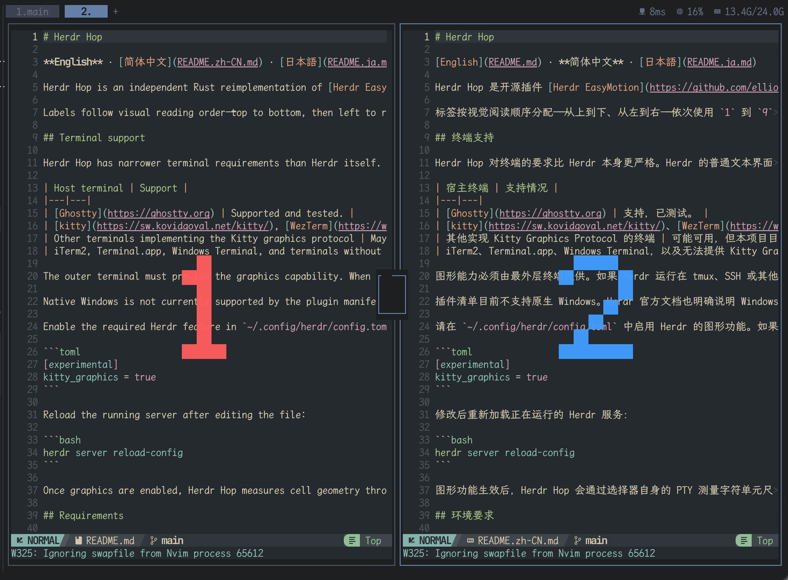

# Herdr Hop

[English](README.md) · [简体中文](README.zh-CN.md) · **日本語**

Herdr Hop は、[Elliot Jackson](https://github.com/elliotekj) が開発したオープンソースプラグイン [Herdr EasyMotion](https://github.com/elliotekj/herdr-easymotion) を Rust で独自に再実装したものです。元のプラグインと同じく、アクションを起動すると各表示ペインに大きなラベルが描画され、そのラベルのキーを押すだけで対象のペインへ直接フォーカスできます。



ラベルは画面上の読み順、つまり上から下、左から右の順に割り当てられます。使用するキーは `1` から `9`、続いて `a` から `g` です。レイアウトが変わらなければラベルも安定するため、キー配置を覚えて素早く移動できます。

## 対応ターミナル

Herdr Hop のターミナル要件は Herdr 本体よりも厳しくなっています。Herdr の通常のテキスト UI は多くのターミナルで動作しますが、このプラグインは Herdr の実験的な [Kitty Graphics ペイン API](https://herdr.dev/docs/socket-api/#experimental-pane-graphics) を使ってラベルを描画します。テキスト表示や Sixel へのフォールバックはありません。

| ホストターミナル | 対応状況 |
|---|---|
| [Ghostty](https://ghostty.org) | 対応済みで、テスト済みです。 |
| [kitty](https://sw.kovidgoyal.net/kitty/)、[WezTerm](https://wezterm.org) | 理論上は対応しています。Herdr のグラフィックス経路がこれらの Kitty Graphics 対応ターミナルを明示的に認識していますが、本プロジェクトではまだテストしていません。 |
| Kitty Graphics Protocol を実装するその他のターミナル | 動作する可能性はありますが、このプロジェクトでは現在検証していません。 |
| iTerm2、Terminal.app、Windows Terminal、および利用可能な Kitty Graphics 経路を持たないターミナル | 非対応です。Herdr 本体が動作しても、Herdr Hop のペインラベルは表示されません。 |

グラフィックス機能は最外層のターミナルが提供する必要があります。tmux、SSH、その他の中間レイヤーを通して Herdr を実行する場合、すべてのレイヤーが Kitty Graphics Protocol を正しく転送しなければなりません。テスト済みの Ghostty から Herdr を直接実行する構成を推奨します。kitty と WezTerm は理論上は対応していますが、本プロジェクトではまだテストしていません。

プラグインマニフェストは現在、ネイティブ Windows をサポートしていません。また、Herdr の公式ドキュメントでは、Windows Terminal は Herdr が必要とする Kitty Graphics 経路を公開しないと説明されています。Linux と macOS はサポート対象です。WSL 構成は Windows 側のホストターミナルに依存し、このプロジェクトでは現在テストしていません。

`~/.config/herdr/config.toml` で Herdr のグラフィックス機能を有効にしてください。すでに `[experimental]` テーブルがある場合は、重複して宣言せず既存のテーブルへ設定を追加します。

```toml
[experimental]
kitty_graphics = true
```

設定ファイルを変更したら、実行中の Herdr サーバーへ再読み込みさせます。

```bash
herdr server reload-config
```

グラフィックスを有効にすると、Herdr Hop はピッカー自身の PTY を通してセルのピクセルサイズを測定します。新しくインストールしたラベルを表示するためだけに、ターミナルを開き直したりセッションへ再アタッチしたりする必要はありません。

## 必要条件

- Herdr 0.8.2 以降
- Linux または macOS
- 上記の Kitty Graphics 対応ターミナル
- Rust と Cargo（現在のインストール処理はソースからプラグインをビルドします）

## インストール

GitHub からインストールします。

```bash
herdr plugin install youguanxinqing/herdr-hop
```

特定のブランチ、タグ、コミットをインストールする場合は `--ref` を指定します。ローカルのチェックアウトを使う場合、`herdr plugin link` はビルドコマンドを実行しないため、先にビルドしてください。

```bash
./scripts/build.sh
herdr plugin link .
```

Herdr にアクションが登録されたことを確認します。

```bash
herdr plugin action list --plugin youguanxinqing.herdr-hop
```

## キーバインド

Herdr の設定へ `plugin_action` バインドを追加し、`herdr server reload-config` を実行します。

```toml
[[keys.command]]
key = "prefix+q"
type = "plugin_action"
command = "youguanxinqing.herdr-hop.jump"
description = "hop to a visible pane"
```

`prefix+q` は一例です。既存の Herdr または外側のターミナルのショートカットと競合しないキーを選んでください。

## 使い方

1. 2 つ以上の表示ペインがある Herdr タブを開きます。
2. 設定したキーバインドを押します。
3. フォーカスしたいペインに表示されたラベルのキーを押します。英字ラベルは大文字と小文字を区別しません。

`Esc` または `Ctrl-C` でキャンセルできます。関係のないキーは無視され、20 秒以内に選択しなかった場合はピッカーが自動的に終了します。フォーカスを移動する前にすべてのラベルを消去するため、元のタブにオーバーレイが残ることはありません。

ラベルを付けられるペインは最大 16 個で、`1`–`9`、続いて `a`–`g` を使います。現在のタブがズーム中、または表示ペインが 2 個未満の場合、プラグインは何もせず終了します。選択中に小さな空のポップアップが短時間表示されることがあります。このポップアップはキー入力の取得だけを担当し、実際のラベルは対象ペイン上に描画されます。

## トラブルシューティング

ピッカーは開くもののラベルが表示されない場合：

1. `[experimental].kitty_graphics = true` が有効で、サーバー設定を再読み込み済みであることを確認します。
2. 外側のターミナルがテスト済みの Ghostty であることを確認します。未テストの kitty、WezTerm、またはその他のターミナルを使用する場合は、Kitty Graphics 経路を正しく提供できることを確認してください。
3. テスト中は tmux、SSH、その他の中間ターミナルレイヤーを外します。
4. プラグインのコマンドログを確認します。

   ```bash
   herdr plugin log list --plugin youguanxinqing.herdr-hop
   ```

## アンインストール

```bash
herdr plugin uninstall youguanxinqing.herdr-hop
```

ローカルのチェックアウトを `plugin link` で登録した場合：

```bash
herdr plugin unlink youguanxinqing.herdr-hop
```

## 開発

プロジェクトで必須のフォーマット、テスト、静的解析を実行します。

```bash
just verify
```

リリースバイナリをビルドし、`herdr-plugin.toml` が要求する場所へ配置します。

```bash
just build
```

## 系譜とクレジット

Herdr Hop は [elliotekj/herdr-easymotion](https://github.com/elliotekj/herdr-easymotion) を参考に、そのペインジャンプのワークフローを Rust で再実装したものです。元のプロジェクトをオープンソースとして公開した [Elliot Jackson](https://github.com/elliotekj) に感謝します。

## ライセンス

Herdr Hop の Rust 実装は [MIT ライセンス](LICENSE) で公開されています。参照元の Herdr EasyMotion は別プロジェクトとして Apache License 2.0 で公開されています。
